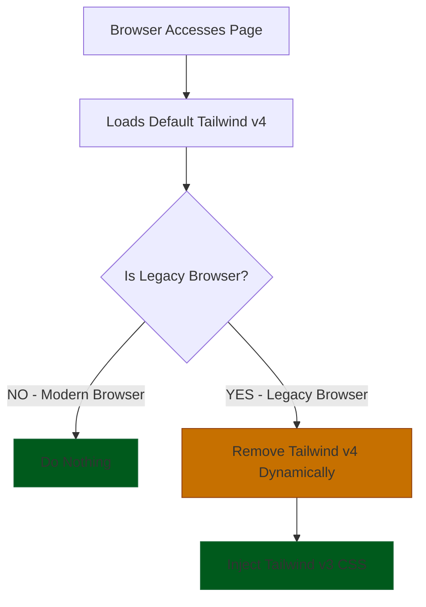

# vite-plugin-tailwind-legacy

⚡ Vite plugin that generates Tailwind v4 CSS with legacy browser compatibility fallback using Tailwind CSS v3.

*Read this in other languages: [Português](README-pt.md)*

### ✨ Why use it?
Problem:

❌ Tailwind v4 uses modern CSS features like `oklch()` that break in older browsers

❌ Conventional polyfills don't completely solve the problem

❌ Maintaining two CSS versions manually is cumbersome

Solution:

✅ Automatically generates a Tailwind v3 fallback for legacy browsers

✅ ZERO impact on Tailwind v4 for modern browsers

✅ Only legacy devices receive the fallback CSS

### 🎬 See the demos in the images below 👇

The plugin's goal is to maintain a consistent experience on legacy browsers without compromising Tailwind v4's advantages (for modern browsers). With careful development for both realities, your site will have very similar appearance and functionality in any browser - modern or old - while you continue leveraging all the advanced v4 features in your workflow.

# ✨ Features

This plugin executes an extra step after the build to:

- Generate legacy CSS with `tailwindcss@3` compatible with older browsers

- Dynamically inject the legacy CSS in browsers that don't support Tailwind v4 (like Chrome < 111) through a `browser-check.js` script in the build HTML files

## 🚀 Installation

```bash
npm install --save-dev vite-plugin-tailwind-legacy
# or
yarn add vite-plugin-tailwind-legacy --dev
```

## ⚙️ Configuration

- Add the `vite-plugin-tailwind-legacy` plugin to your Vite config.

```javascript
import { defineConfig } from 'vite'
import tailwindcss from '@tailwindcss/vite'
import TailwindLegacyPlugin from 'vite-plugin-tailwind-legacy'; 

export default defineConfig(({ command }) => {
  const isBuild = command === 'build';

   return {
      plugins: [
        react(),
        tailwindcss(),
        TailwindLegacyPlugin({
          tailwindConfig: 'tailwind.config.legacy.js',
          assetsDir: 'dist/assets',
          publicPath: '/static/assets/',
          injectInHTML: true,
        })
      ],      
}
})
```

## 🛠 Important Information

⚠️ **Special Attention** - Before proceeding, pay attention to these two important pieces of information:

1 - The `content` field - it should point to your Vite's final build:

```javascript
content: ["./dist/**/*.{html,js}"],  // 👈 Verify this path matches your files built by Vite
```

2 - Colors

Tailwind v4 uses `oklch()` as the default color format, which doesn't work in older browsers. To ensure functionality:

- Use hexadecimal colors (`#RRGGBB`) in your theme
- Convert `oklch` values (https://oklch.com)

Basic example:
```javascript
colors: {
  primary: '#1445e2',       // Compatible format
  secondary: '#4f46e5'      // Compatible format
}
```

## ⚙️ Tailwind Configuration (Legacy Version)
📁 Create a `tailwind.config.legacy.js` file in the same directory as your `vite.config.ts` with this base structure (Change colors to match your theme):
```javascript
/** @type {import('tailwindcss').Config} */
module.exports = {
  content: ["./dist/**/*.{html,js}"],
  darkMode: ['class'],
  theme: {
    extend: {
      colors: {
        background: '#fefeff',
        foreground: '#333333',
        card: '#ffffff',
        "card-foreground": '#333333',
        popover: '#ffffff',
        "popover-foreground": '#333333',
        primary: '#1445e2',
        "primary-foreground": '#f9f9f9',
        secondary: '#0598f6',
        "secondary-foreground": '#f9f9f9',
        muted: '#f0f0ff',
        "muted-foreground": '#7a7a99',
        accent: '#b76b2c',
        "accent-foreground": '#ffffff',
        destructive: '#e74c3c',
        "destructive-foreground": '#fff2f2',
        border: '#e0e0f0',
        input: '#e0e0f0',
        ring: '#333333',
        chart: {
          1: '#c96d3f',
          2: '#47c1a9',
          3: '#4297e7',
          4: '#8a64d1',
          5: '#df5d8f',
        },
        base: {
          100: '#fefeff',
          200: '#f0f0ff',
          300: '#e3e3ff',
          content: '#333333',
        },
        
        neutral: '#6b6b8d',
        "neutral-content": '#fefeff',
        info: '#5bbef0',
        "info-content": '#f6faff',
        success: '#63d182',
        "success-content": '#f0fff5',
        warning: '#f6d365',
        "warning-content": '#fff9e3',
        error: '#e74c3c',
        "error-content": '#fff2f2',
        
        sidebar: '#fbfbff',
        "sidebar-foreground": '#252525',
        "sidebar-primary": '#252525',
        "sidebar-primary-foreground": '#fbfbff',
        "sidebar-accent": '#f0f0ff',
        "sidebar-accent-foreground": '#252525',
        "sidebar-border": '#e8e8e8',
        "sidebar-ring": '#737373',
      },

      borderRadius: {
        sm: 'calc(0.625rem - 4px)',
        md: 'calc(0.625rem - 2px)',
        lg: '0.625rem',
        xl: 'calc(0.625rem + 4px)',
      },

      height: {
           ...Array.from({ length: 1000 }, (_, i) => i + 1).reduce((acc, val) => {
          acc[val] = `${val * 0.25}rem`;
          return acc;
        }, {}),
      },
      width: {
           ...Array.from({ length: 1000 }, (_, i) => i + 1).reduce((acc, val) => {
          acc[val] = `${val * 0.25}rem`;
          return acc;
        }, {}),
      },
      padding: {
        ...Array.from({ length: 1000 }, (_, i) => i + 1).reduce((acc, val) => {
          acc[val] = `${val * 0.25}rem`;
          return acc;
        }, {}),
      },
      margin: {
        ...Array.from({ length: 1000 }, (_, i) => i + 1).reduce((acc, val) => {
          acc[val] = `${val * 0.25}rem`;
          return acc;
        }, {}),
      },
      gap: {
           ...Array.from({ length: 1000 }, (_, i) => i + 1).reduce((acc, val) => {
          acc[val] = `${val * 0.25}rem`;
          return acc;
        }, {}),
      },
      zIndex: {
        ...Array.from({ length: 1000 }, (_, i) => i + 1).reduce((acc, val) => {
          acc[val] = `${val}`;
          return acc;
        }, {}),
      },
    },
  },
  plugins: [
    require('tailwindcss-animate'), // Remove this if you don't use it
    function({ addBase }) {
          addBase({
            'button': {
              backgroundColor: 'transparent',
              backgroundImage: 'none',
              padding: 0,
              border: 'none',
              outline: 'none',
              cursor: 'pointer',
            },
          });
        },
  ],
};
```

## 📝 How to Use
1. Install the plugin as shown above
2. Configure your Vite config according to the example
3. Create the Tailwind configuration file
4. Run your Vite build normally [it might ask for authorization to install tailwind-v3 [this shouldn't interfere with your project as it won't install in your project's `package.json`]]

## 🛠 Specific Configurations

Default configs:
```javascript
TailwindLegacyPlugin({
  tailwindConfig: 'tailwind.config.legacy.js', // Change the tailwindConfig directory
  inputCSS: 'input.css', // Change the input CSS filename
  assetsDir: 'dist/assets', // Change the output directory for generated files
  publicPath: '/static/assets/',  // Change the public path
  buildDir: 'dist', // Change the build output directory to scan for HTML files
  injectInHTML: true,   // Enable insertion of legacy browser check script
  deleteStyles: ['app', 'layout'],  // Select which stylesheet will be deleted, if empty deletes all
  outputCSSName: 'tailwind-v3-legacy.css', // Change the name of the generated css file, must end with .css
})
```

#### 📂 tailwindConfig

Default: `'tailwind.config.legacy.js'`

What it does: Specifies the path to the Tailwind v3 configuration file

When to change: If you want to use a different name for the configuration file or directory

Example:
```javascript
tailwindConfig: './config/tailwind-legacy-config.js'
```

#### 📄 inputCSS

Default: `'input.css'`

What it does: Specifies the temporary input CSS file name that will be created during the build process

When to change: If you need to avoid conflicts with existing files in your project

Example:
```javascript
inputCSS: 'legacy-input.css'
// or
inputCSS: 'src/test/legacy-input.css'
```

#### 📁 assetsDir

Default: `'dist/assets'`

What it does: Defines where the generated CSS and JS files will be saved

When to change: If your build uses a different directory structure

Example:
```javascript
assetsDir: 'build/static'
```

#### 🌐 publicPath

Default: `'/static/assets/'`

What it does: Controls the public path used to load assets in the HTML

When to change: When assets are served from a different path

Example:
```javascript
publicPath: '/static/' // relative path
// or
publicPath: 'https://cdn.example.com/assets/' // full URL with host
```

#### 📂 buildDir

Default: `'dist'`

What it does: Specifies the build output directory where HTML files are located for script injection

When to change: When using different frameworks (e.g., Nuxt uses `.output/public`, Next.js uses `out`, etc.)

Example:
```javascript
buildDir: '.output/public'  // For Nuxt
// or
buildDir: 'out'  // For Next.js static export
```

#### ✨ injectInHTML

Default: `true`

What it does: Automatically injects the legacy browser check script

When to disable (false): For SSG (like Next.js, Gatsby), you can use the backend (Django, for example) to check the client's browser before serving the HTML, avoiding misconfiguration, and you can already inject the `output.css` generated by the plugin.

For server-side implementations (Django, Rails, etc), see:  

[BACKEND-INTEGRATION.md](./BACKEND-INTEGRATION.md)  
*(Includes examples of browser detection and controlled fallback)*


#### 🎯 deleteStyles

Default: `[]` (empty array)

What it does: Defines which CSS files will be removed in legacy browsers. If empty, removes ALL styles. If filled, removes only the specified ones.

When to use: When you want to preserve some styles (e.g., component CSS, critical styles) and only replace Tailwind.

Example:
```javascript
deleteStyles: ['app', 'layout'] // removes app.css, app-abc123.css, layout.css, layout-min.css, etc.
// or 
deleteStyles: ['app.css', 'layout.css'] // removes app.css, layout.css, etc.
```
#### 📄 outputCSSName
Default: `'tailwind-v3-legacy.css'`

What it does: Defines the name of the CSS file generated by Tailwind v3 for legacy browsers.

When to change: To customize the fallback file name or avoid conflicts.

Example:
```javascript
outputCSSName: 'legacy-styles.css' // generates legacy-styles.css instead of default.
```

## 🔄 Browser Compatibility

🚨 Legacy Browser Limitations

**The Flexbox/Grid `gap` feature doesn't have full support in:**
- Chrome < 84 (released in 2020)
- Firefox < 80 (released in 2020)
- Safari < 14.1 (released in 2021)
- Edge < 84 (released in 2020)

You can work around this by using other CSS classes in your project, keeping in mind compatibility with very old browsers.

## ❓ How does it work?

1. The `vite-plugin-tailwind-legacy` creates a v3-based CSS file for legacy browsers

2. It adds a script to HTML files that checks if it's a legacy browser, and if so, uses `output.css` as a fallback for legacy browsers.

### 🔄 `vite-plugin-tailwind-legacy` Flow



# 🔍 Examples

### Before and after the plugin on Chrome 85.0.4183.102 mobile (just generated output.css and applied it to the site via Developer Tools)

Shadcn https://ui.shadcn.com/docs/components/avatar
<div style="display: flex; flex-direction: column; gap: 16px;">
  <div style="display: flex; gap: 16px;">
    
    
  </div>
  
</div>

## Sites in development with Tailwind v4 =>

Before and after the plugin on Chrome 85.0.4183.102 mobile
<div style="display: flex; gap: 10px;">
  
  
</div>


## 📊 Performance

- **Zero impact** on modern browsers (no extra CSS loaded)
- **Minimal impact** on legacy browsers (only one additional HTTP request)
- Generated CSS is automatically minified